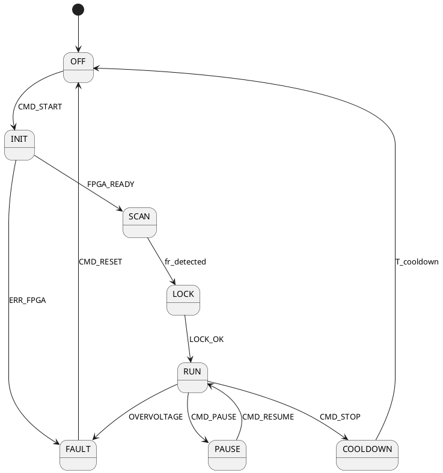
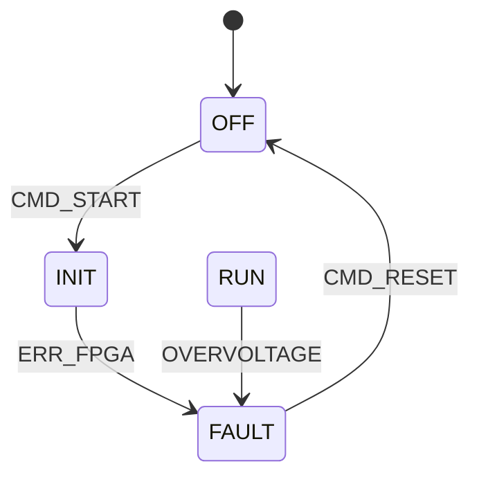

# 03 — FSM Modeling Tools

[← 02](02-efsm-complete-description.md) | [Next: Blocking →](04-blocking-problem.md)

---

## Tool Levels

| Level | Question answered | Tools |
|-------|-----------------|-------|
| **1 — Drawing** | What does the FSM look like? | PlantUML, Mermaid, draw.io |
| **2 — Simulation** | Does it behave correctly? | Yakindu, Stateflow |
| **3 — Code generation** | What code does it produce? | SMC, Boost.SML, QP/C |
| **4 — Formal verification** | Is it provably correct? | SPIN, UPPAAL |

## Level 1 — PlantUML (recommended minimum)

Text-based, versionable in Git, renders automatically in GitLab/GitHub.



**Mermaid** — renders natively in GitHub/GitLab Markdown:



## Level 2 — Yakindu / itemis CREATE

- Graphical + textual editor
- **Interactive simulation** — click events, watch the FSM evolve in real-time
- C/C++/Java code generation
- Unreachable state detection
- Free (basic) / Paid (pro)

## Level 3 — Boost.SML (modern C++)

FSM as a C++ type, verified at compile time. Zero runtime overhead.

```cpp
auto piezo_fsm = sml::make_transition_table(
  *sml::state<OFF>   + sml::event<CMD_START>   / fpga_init   = sml::state<INIT>,
   sml::state<INIT>  + sml::event<FPGA_READY>  / start_sweep = sml::state<SCAN>,
   sml::state<RUN>   + sml::event<OVERVOLTAGE> / power_cut   = sml::state<FAULT>
);
// Missing transition = compile error
```

## Level 4 — SPIN / Promela (formal verification)

Exhaustively explores all reachable states to prove safety properties.

```promela
// Property: impossible to reach RUN from FAULT without passing through OFF
ltl safety { [] (state == FAULT -> !(state == RUN U state == OFF)) }
// spin -a fsm.pml && gcc pan.c && ./pan -a
// → SPIN checks all paths exhaustively
```

## Choosing

| Context | Recommended tool |
|---------|-----------------|
| Team documentation | PlantUML or Mermaid |
| Rapid prototype | draw.io + manual code |
| Serious C project | Yakindu + SMC |
| Modern C++ | Boost.SML |
| Event-driven / active objects | QP/C or QP/C++ |
| Automotive (ISO 26262) | Stateflow + Embedded Coder |
| Avionics (DO-178C) | Rhapsody or Stateflow |
| Property verification | SPIN or UPPAAL |

---

*[← 02](02-efsm-complete-description.md) | [Next: Blocking →](04-blocking-problem.md)*
