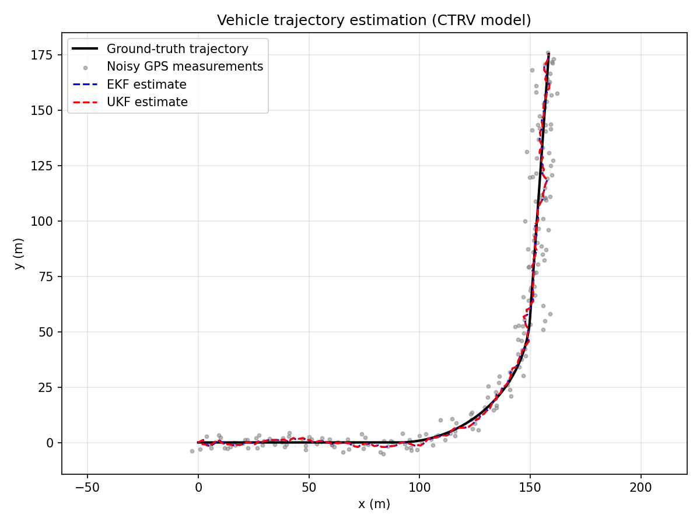

# Vehicle Trajectory Estimation with Kalman Filters (EKF / UKF / IMU+GPS Fusion)

Python implementation of an Extended Kalman Filter (EKF) and an Unscented
Kalman Filter (UKF) to estimate a vehicle's trajectory from noisy position
measurements (typically GPS), using the **CTRV** motion model (*Constant
Turn Rate and Velocity*) — the standard choice for road vehicle tracking,
since it naturally captures turns without crude linearisation.

It also includes a **loosely-coupled IMU + GPS fusion** module, where a
high-rate IMU (accelerometer + gyroscope) drives the prediction step and a
low-rate, noisy GPS corrects the accumulated drift.



> **Looking for the precise mathematical specification of every filter and
> the IMU/GPS fusion model (state definitions, equations, Jacobians, noise
> models)?** See [`SPECIFICATION.md`](SPECIFICATION.md).

## Why CTRV?

| Model | Assumption | Limitation |
|---|---|---|
| CV (constant velocity) | straight-line motion | poor in turns |
| CA (constant acceleration) | constant acceleration | still straight-line |
| **CTRV** | constant speed and turn rate | reference model for road vehicles |
| CTRA | + acceleration | useful when braking/accelerating in a turn |

The CTRV model is **non-linear** (it involves `sin(psi)`, `cos(psi)`),
which is why an EKF (linearisation via Jacobians) or a UKF (sigma points,
no Jacobians needed) is required instead of a plain linear Kalman filter.

## Repository structure

```
vehicle-tracking-kalman/
├── vehicle_tracking/
│   ├── __init__.py
│   ├── models.py             # CTRV model: f(x,dt), Jacobian F, h(x), Jacobian H, Q
│   ├── ekf.py                 # generic Extended Kalman Filter
│   ├── ukf.py                 # generic Unscented Kalman Filter
│   ├── imu_gps_fusion.py      # loosely-coupled IMU + GPS fusion (EKF)
│   ├── simulate.py            # GPS-only simulation: EKF vs UKF comparison
│   └── simulate_imu_gps.py    # IMU (100 Hz) + GPS (1 Hz) fusion demo
├── SPECIFICATION.md           # mathematical specification of all filters
├── requirements.txt
├── LICENSE
└── README.md
```

## Installation

```bash
git clone https://github.com/<your-username>/vehicle-tracking-kalman.git
cd vehicle-tracking-kalman
pip install -r requirements.txt
```

## Quick start

### GPS-only tracking (EKF vs UKF)

```bash
python -m vehicle_tracking.simulate
```

This script:
1. generates a ground-truth trajectory (straight line then a turn),
2. simulates noisy GPS measurements,
3. estimates the trajectory with an EKF and a UKF,
4. prints the RMSE of each filter and saves `trajectory.png`.

Typical output:
```
Position RMSE - Raw measurements : 4.026 m
Position RMSE - EKF              : 1.317 m
Position RMSE - UKF              : 1.298 m
```

### IMU + GPS fusion

```bash
python -m vehicle_tracking.simulate_imu_gps
```

This script:
1. generates a ground-truth trajectory,
2. derives noisy IMU readings (acceleration, yaw rate) at 100 Hz,
3. simulates noisy GPS fixes at 1 Hz,
4. runs a loosely-coupled EKF that predicts at the IMU rate and corrects at
   the GPS rate,
5. prints the RMSE and saves `imu_gps_fusion.png`.

Typical output:
```
Position RMSE - GPS fixes only (raw)      : 3.961 m
Position RMSE - IMU+GPS fused (100Hz/1Hz) : 3.188 m
Number of IMU prediction steps: 1800, number of GPS updates: 18
```

The fused estimate is smoother and more accurate than raw GPS fixes, and
remains usable at 100 Hz even between two GPS updates — which matters for
any downstream control loop that needs a continuous state estimate.

## Using it in your own code

### GPS-only (CTRV + EKF)

```python
import numpy as np
from vehicle_tracking import (
    f_ctrv, F_jacobian_ctrv, h_position, H_jacobian_position,
    process_noise_Q, ExtendedKalmanFilter,
)

dt = 0.1
x0 = np.array([0.0, 0.0, 15.0, 0.0, 0.0])       # px, py, v, psi, psi_dot
P0 = np.diag([5.0, 5.0, 4.0, 0.5, 0.2])
R = np.diag([3.0**2, 3.0**2])                    # GPS noise (m)
Q = lambda dt_: process_noise_Q(dt_, std_a=2.0, std_psidd=0.3)

ekf = ExtendedKalmanFilter(f_ctrv, F_jacobian_ctrv, h_position,
                            H_jacobian_position, Q, R, x0, P0)

for z_gps in gps_measurements:      # real-time loop
    ekf.predict(dt)
    ekf.update(z_gps)
    estimate = ekf.x                # [px, py, v, psi, psi_dot]
```

### IMU + GPS fusion

```python
import numpy as np
from vehicle_tracking import ImuGpsEKF

x0 = np.array([0.0, 0.0, 15.0, 0.0])  # px, py, v, psi
P0 = np.diag([5.0, 5.0, 4.0, 0.5])
R_gps = np.diag([3.0**2, 3.0**2])

fused = ImuGpsEKF(x0, P0, R_gps, std_a=0.5, std_omega=0.05)

dt_imu = 0.01
for k, (accel, gyro) in enumerate(imu_stream):   # 100 Hz loop
    fused.predict(dt_imu, accel, gyro)
    if gps_available_at(k):
        fused.update(read_gps())                  # 1-10 Hz correction
    estimate = fused.x                             # [px, py, v, psi]
```

## Adapting the model to your sensors

- **GPS only**: use `h_position` / `H_jacobian_position` as is.
- **Radar/lidar (range, bearing)**: replace `h_position` with a polar model
  `h(x) = [sqrt(px²+py²), atan2(py,px)]` and provide its Jacobian (see the
  EKF chapter of the accompanying theoretical documentation).
- **IMU + GPS**: use `imu_gps_fusion.py` as a starting point. For a
  *tightly-coupled* scheme, the raw GPS pseudoranges (rather than the
  already-computed GPS position) would be fed directly into the update
  step — not covered here, but the same EKF machinery applies.

## Tuning Q and R

- `R` (measurement noise): derive it from sensor specifications (e.g. GPS
  accuracy ≈ 1 to 5 m under degraded urban conditions, IMU noise from the
  datasheet) or estimate it statistically on stationary data.
- `Q` (process noise): the `std_a` (longitudinal acceleration noise) and
  `std_psidd` / `std_omega` (angular acceleration / gyro noise) parameters
  control how reactive the filter is. Too low and the filter is slow to
  react to a turn; too high and it becomes overly sensitive to measurement
  noise.

## Going further

- **IMM filter**: if the vehicle alternates between very different
  behaviours (straight line, sharp turn, emergency braking), consider an
  Interacting Multiple Model filter combining several CTRV/CTRA instances.
- **Multi-vehicle tracking**: add a data association step (nearest
  neighbour, JPDA) if several vehicles are tracked simultaneously.
- **Tightly-coupled IMU/GPS**: fuse raw pseudorange measurements directly
  instead of the GPS-computed position, for improved robustness in
  degraded GPS environments.
- **Non-linear sensors**: for an onboard radar/lidar measuring range and
  bearing relative to the ego-vehicle, the UKF is generally recommended
  since it avoids deriving Jacobians for potentially complex observation
  functions.

## License

MIT — see [LICENSE](LICENSE).
